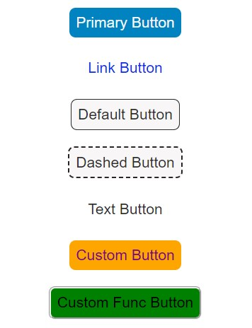

# Fox UI Button Package 




[](https://www.npmjs.com/package/foxui) [](https://standardjs.com)

## Install

```bash
npm install --save foxui
```

## Usage

`TYPE = [primary, link, dashed, text, default]`

```jsx
import React from 'react'
import { Button } from 'foxui'
 
const App = () => {
  return (
    <div ><br />
      <Button type="primary" text="Primary Button" /> <br /><br />
      <Button type="link" text="Link Button" /><br /><br />
      <Button text="Default Button" /><br /><br />
      <Button type="dashed" text="Dashed Button" /><br /><br />
      <Button type="text" text="Text Button" /><br /><br />
      <Button type="primary" text="Custom Button" backColor="orange" textColor="purple" /><br /><br />
      <Button text="Custom Func Button" style={{ color: "#0000", border: "3px groove", backgroundColor: "green" }} onClick={() => alert("Clicked")} /><br /><br />
    </div>
  )
}

export default App
```

## License

MIT © [cantsnn](https://github.com/cantsnn)
